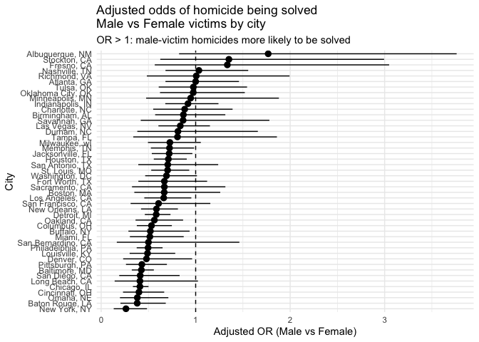
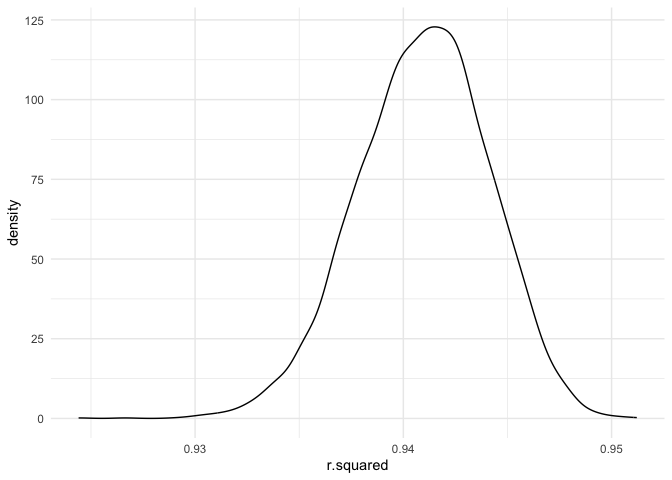
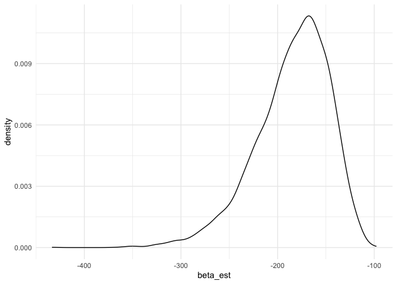
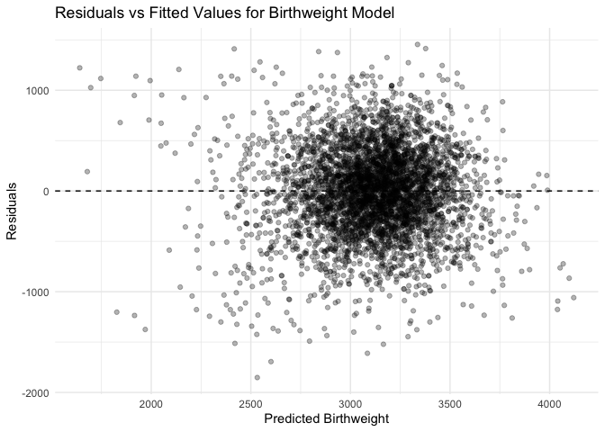
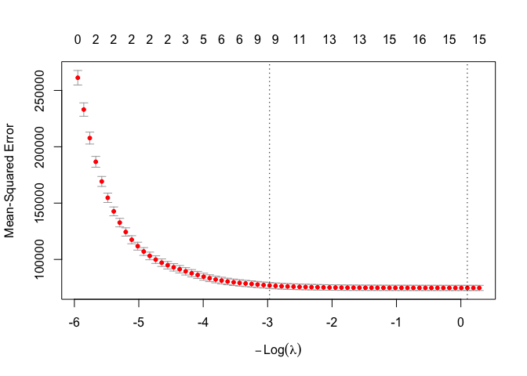
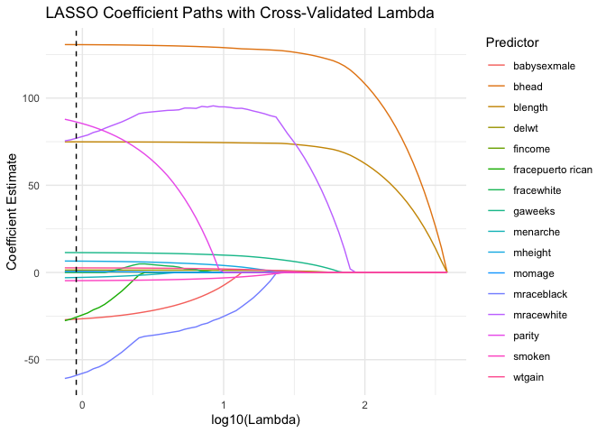
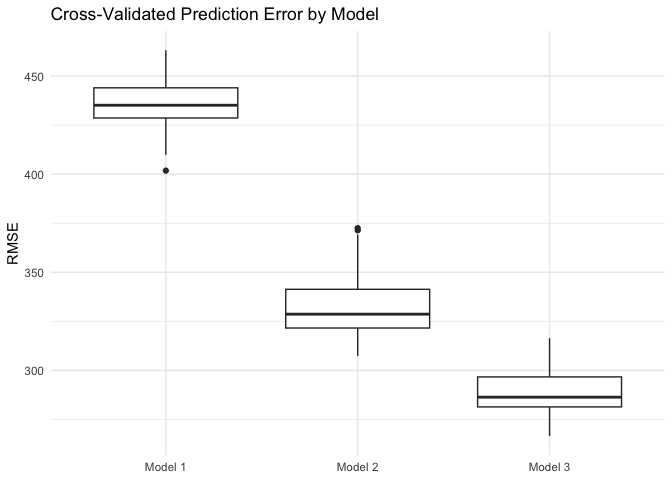
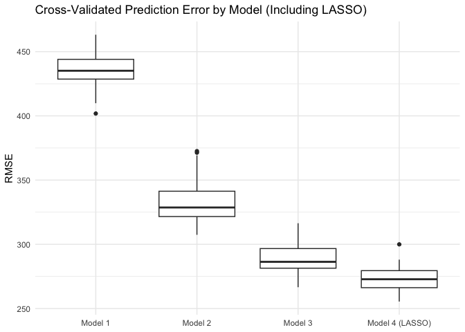

HW 6
================
Devon Park
2025-12-03

``` r
library(tidyverse)
```

    ## ── Attaching core tidyverse packages ──────────────────────── tidyverse 2.0.0 ──
    ## ✔ dplyr     1.1.4     ✔ readr     2.1.5
    ## ✔ forcats   1.0.0     ✔ stringr   1.5.1
    ## ✔ ggplot2   3.5.2     ✔ tibble    3.3.0
    ## ✔ lubridate 1.9.4     ✔ tidyr     1.3.1
    ## ✔ purrr     1.1.0     
    ## ── Conflicts ────────────────────────────────────────── tidyverse_conflicts() ──
    ## ✖ dplyr::filter() masks stats::filter()
    ## ✖ dplyr::lag()    masks stats::lag()
    ## ℹ Use the conflicted package (<http://conflicted.r-lib.org/>) to force all conflicts to become errors

``` r
library(broom)

library(modelr)
```

    ## 
    ## Attaching package: 'modelr'
    ## 
    ## The following object is masked from 'package:broom':
    ## 
    ##     bootstrap

``` r
library(mgcv)
```

    ## Loading required package: nlme
    ## 
    ## Attaching package: 'nlme'
    ## 
    ## The following object is masked from 'package:dplyr':
    ## 
    ##     collapse
    ## 
    ## This is mgcv 1.9-3. For overview type 'help("mgcv-package")'.

``` r
library(glmnet)
```

    ## Loading required package: Matrix
    ## 
    ## Attaching package: 'Matrix'
    ## 
    ## The following objects are masked from 'package:tidyr':
    ## 
    ##     expand, pack, unpack
    ## 
    ## Loaded glmnet 4.1-10

``` r
library(palmerpenguins)
```

    ## 
    ## Attaching package: 'palmerpenguins'
    ## 
    ## The following objects are masked from 'package:datasets':
    ## 
    ##     penguins, penguins_raw

``` r
set.seed(1)
```

# Problem 1

The Washington Post has gathered data on homicides in 50 large U.S.
cities and made the data available through a GitHub repository here. You
can read their accompanying article here.

### Clean the data

###### Step 1. Make variables (2)

Create a city_state variable (e.g. “Baltimore, MD”) and a binary
variable indicating whether the homicide is solved.

###### Step 2. Omit the following cities:

- Dallas, TX (does not report victim race)
- Phoenix, AZ (does not report victim race)
- Kansas City, MO (does not report victim race)
- Tulsa, AL (data entry mistake)

###### Step 3. Filter Rsults:

For this problem, limit your analysis those for whom victim_race is
white or black. Be sure that victim_age is numeric.

``` r
homicide_df = 
  read_csv("Data/homicide-data.csv")|>
  janitor::clean_names()
```

    ## Rows: 52179 Columns: 12
    ## ── Column specification ────────────────────────────────────────────────────────
    ## Delimiter: ","
    ## chr (9): uid, victim_last, victim_first, victim_race, victim_age, victim_sex...
    ## dbl (3): reported_date, lat, lon
    ## 
    ## ℹ Use `spec()` to retrieve the full column specification for this data.
    ## ℹ Specify the column types or set `show_col_types = FALSE` to quiet this message.

``` r
homicides = homicide_df |>
  
  #create city state variable that combines variables city and state and uses delimeter ", ".
  
  mutate(city_state = str_c(city, state, sep = ", "),
         solved_case = case_when(
              disposition == "Closed by arrest" ~ 1, #the only option where the case is solved
              TRUE ~ 0 #for all other options "Open/No arrest" or "Closed without arrest" make these 0
         ),
         victim_age = as.numeric(victim_age)) |> #Values that were previouls "Unknown" are now NA
  
  filter(!(city_state %in% c("Dallas, TX", "Phoenix, AZ",  "Kansas City, MO", "Tulsa, AL")),
        victim_race %in% c("White", "Black")) 
```

    ## Warning: There was 1 warning in `mutate()`.
    ## ℹ In argument: `victim_age = as.numeric(victim_age)`.
    ## Caused by warning:
    ## ! NAs introduced by coercion

As we will be looking at victim age, sex and race as predictors, I
looked at what values these variables take in the dataset.

``` r
  homicide_df |> distinct(victim_race)
```

    ## # A tibble: 6 × 1
    ##   victim_race
    ##   <chr>      
    ## 1 Hispanic   
    ## 2 White      
    ## 3 Other      
    ## 4 Black      
    ## 5 Asian      
    ## 6 Unknown

``` r
  homicide_df |> distinct(victim_sex)
```

    ## # A tibble: 3 × 1
    ##   victim_sex
    ##   <chr>     
    ## 1 Male      
    ## 2 Female    
    ## 3 Unknown

``` r
  homicide_df |> distinct(victim_age)
```

    ## # A tibble: 102 × 1
    ##    victim_age
    ##    <chr>     
    ##  1 78        
    ##  2 17        
    ##  3 15        
    ##  4 32        
    ##  5 72        
    ##  6 91        
    ##  7 52        
    ##  8 56        
    ##  9 43        
    ## 10 20        
    ## # ℹ 92 more rows

There are several “Unkown” values in the vicitim_race and victim_sex
columns and several NA values in the victim_age column. All of these
were removed before the regression model was ran.

``` r
homicides = homicides |> 
  filter(
  victim_sex %in% c("Male", "Female"),
  victim_race %in% c("Hispanic", "White","Other", "Black", "Asian")
) |> 
  drop_na(victim_age)
```

### Logistic Regression Babyyyyyyy

- For the city of Baltimore, MD, use the glm function to fit a logistic
  regression with resolved vs unresolved as the outcome and victim age,
  sex and race as predictors.
- Save the output of glm as an R object; apply the broom::tidy to this
  object; and obtain the estimate and confidence interval of the
  adjusted odds ratio for solving homicides comparing male victims to
  female victims keeping all other variables fixed.

``` r
baltimore =
  homicides |>
  filter(city_state == "Baltimore, MD")
```

``` r
baltimore_fit =
  glm(
    solved_case ~ victim_age + victim_sex + victim_race,
    data = baltimore,
    family = binomial()
  )


  baltimore_fit |> 
  broom::tidy() |> 
  mutate(
    term = str_replace_all(term, c(
        "victim_sex" = "victim_sex: ",
        "victim_race" = "victim_race: "))
  ) |> 
  select(term, estimate, p.value) |> 
  knitr::kable(digits = 3)
```

| term               | estimate | p.value |
|:-------------------|---------:|--------:|
| (Intercept)        |    0.310 |   0.070 |
| victim_age         |   -0.007 |   0.043 |
| victim_sex: Male   |   -0.854 |   0.000 |
| victim_race: White |    0.842 |   0.000 |

``` r
baltimore_or =
  baltimore_fit |>
  broom::tidy(conf.int = TRUE, exponentiate = TRUE) |>
  select(term, estimate, conf.low, conf.high)|>
    mutate(
    term = str_replace_all(term, c(
        "victim_sex" = "victim_sex: ",
        "victim_race" = "victim_race: "))
  ) |> 
  knitr::kable(digits = 3)

  baltimore_fit |>
  broom::tidy(conf.int = TRUE, exponentiate = TRUE) |>
  filter(term == "victim_sexMale") |> 
  select(term, estimate, conf.low, conf.high)|>
  knitr::kable(digits = 3)
```

| term           | estimate | conf.low | conf.high |
|:---------------|---------:|---------:|----------:|
| victim_sexMale |    0.426 |    0.324 |     0.558 |

### Regression for all the cities

Now run glm for each of the cities in your dataset, and extract the
adjusted odds ratio (and CI) for solving homicides comparing male
victims to female victims. Do this within a “tidy” pipeline, making use
of purrr::map, list columns, and unnest as necessary to create a
dataframe with estimated ORs and CIs for each city.

group all rows with the same city state

``` r
city_models =
  homicides |>
  group_by(city_state) |>
  nest()
```

Use map to run glm across each row

``` r
city_models =
  city_models |>
  mutate(
    fit = map(data, ~ glm(
          solved_case ~ victim_age + victim_sex + victim_race,
          data   = .x,
          family = binomial()
        ))
  )
```

Exponentiate to get the OR and CIs

``` r
city_models =
  city_models |>
  mutate(
    results = map(
      fit,
      ~ tidy(.x, conf.int = TRUE, exponentiate = TRUE)
    )
  )
```

Specifically pull out the odds ratio of solved cases for males vs
females. (adjsuting for age and race)

``` r
city_or =
  city_models |>
  select(city_state, results) |>
  unnest(results) |>
  filter(term == "victim_sexMale") |>
  select(
    city_state,
    estimate,   # OR
    conf.low,   # lower 95% CI
    conf.high   # upper 95% CI
  ) |>
  arrange(estimate)
```

Nice outout!

``` r
city_or |> knitr::kable(digits = 3)
```

| city_state         | estimate | conf.low | conf.high |
|:-------------------|---------:|---------:|----------:|
| New York, NY       |    0.262 |    0.133 |     0.485 |
| Baton Rouge, LA    |    0.381 |    0.204 |     0.684 |
| Omaha, NE          |    0.382 |    0.199 |     0.711 |
| Cincinnati, OH     |    0.400 |    0.231 |     0.667 |
| Chicago, IL        |    0.410 |    0.336 |     0.501 |
| Long Beach, CA     |    0.410 |    0.143 |     1.024 |
| San Diego, CA      |    0.413 |    0.191 |     0.830 |
| Baltimore, MD      |    0.426 |    0.324 |     0.558 |
| Pittsburgh, PA     |    0.431 |    0.263 |     0.696 |
| Denver, CO         |    0.479 |    0.233 |     0.962 |
| Louisville, KY     |    0.491 |    0.301 |     0.784 |
| Philadelphia, PA   |    0.496 |    0.376 |     0.650 |
| San Bernardino, CA |    0.500 |    0.166 |     1.462 |
| Miami, FL          |    0.515 |    0.304 |     0.873 |
| Buffalo, NY        |    0.521 |    0.288 |     0.936 |
| Columbus, OH       |    0.532 |    0.377 |     0.748 |
| Oakland, CA        |    0.563 |    0.364 |     0.867 |
| Detroit, MI        |    0.582 |    0.462 |     0.734 |
| New Orleans, LA    |    0.585 |    0.422 |     0.812 |
| San Francisco, CA  |    0.608 |    0.312 |     1.155 |
| Los Angeles, CA    |    0.662 |    0.457 |     0.954 |
| Boston, MA         |    0.667 |    0.351 |     1.260 |
| Sacramento, CA     |    0.669 |    0.326 |     1.314 |
| Fort Worth, TX     |    0.669 |    0.394 |     1.121 |
| Washington, DC     |    0.691 |    0.466 |     1.014 |
| St. Louis, MO      |    0.703 |    0.530 |     0.932 |
| San Antonio, TX    |    0.705 |    0.393 |     1.238 |
| Houston, TX        |    0.711 |    0.557 |     0.906 |
| Jacksonville, FL   |    0.720 |    0.536 |     0.965 |
| Memphis, TN        |    0.723 |    0.526 |     0.984 |
| Milwaukee, wI      |    0.727 |    0.495 |     1.054 |
| Tampa, FL          |    0.808 |    0.340 |     1.860 |
| Durham, NC         |    0.812 |    0.382 |     1.658 |
| Las Vegas, NV      |    0.837 |    0.606 |     1.151 |
| Savannah, GA       |    0.867 |    0.419 |     1.780 |
| Birmingham, AL     |    0.870 |    0.571 |     1.314 |
| Charlotte, NC      |    0.884 |    0.551 |     1.391 |
| Indianapolis, IN   |    0.919 |    0.678 |     1.241 |
| Minneapolis, MN    |    0.947 |    0.476 |     1.881 |
| Oklahoma City, OK  |    0.974 |    0.623 |     1.520 |
| Tulsa, OK          |    0.976 |    0.609 |     1.544 |
| Atlanta, GA        |    1.000 |    0.680 |     1.458 |
| Richmond, VA       |    1.006 |    0.483 |     1.994 |
| Nashville, TN      |    1.034 |    0.681 |     1.556 |
| Fresno, CA         |    1.335 |    0.567 |     3.048 |
| Stockton, CA       |    1.352 |    0.626 |     2.994 |
| Albuquerque, NM    |    1.767 |    0.825 |     3.762 |

##### In one pipeline: (but this is kind of confusing to my eyes)

``` r
city_or =
  homicides |>
  group_by(city_state) |>
  nest() |> 
  mutate(
    fit = map(data, ~ glm(
          solved_case ~ victim_age + victim_sex + victim_race,
          data   = .x,
          family = binomial())),
    results = map(fit, ~ tidy(.x, conf.int = TRUE, exponentiate = TRUE))
  ) |>
  select(city_state, results) |>
  unnest(results) |>
  filter(term == "victim_sexMale") |>
  select(
    city_state,
    estimate,   #the OR
    conf.low,   #95%CI lower bound
    conf.high   #95%CI upper bound
  ) |>
  arrange(estimate) 

city_or |> 
  knitr::kable(digits = 3)
```

| city_state         | estimate | conf.low | conf.high |
|:-------------------|---------:|---------:|----------:|
| New York, NY       |    0.262 |    0.133 |     0.485 |
| Baton Rouge, LA    |    0.381 |    0.204 |     0.684 |
| Omaha, NE          |    0.382 |    0.199 |     0.711 |
| Cincinnati, OH     |    0.400 |    0.231 |     0.667 |
| Chicago, IL        |    0.410 |    0.336 |     0.501 |
| Long Beach, CA     |    0.410 |    0.143 |     1.024 |
| San Diego, CA      |    0.413 |    0.191 |     0.830 |
| Baltimore, MD      |    0.426 |    0.324 |     0.558 |
| Pittsburgh, PA     |    0.431 |    0.263 |     0.696 |
| Denver, CO         |    0.479 |    0.233 |     0.962 |
| Louisville, KY     |    0.491 |    0.301 |     0.784 |
| Philadelphia, PA   |    0.496 |    0.376 |     0.650 |
| San Bernardino, CA |    0.500 |    0.166 |     1.462 |
| Miami, FL          |    0.515 |    0.304 |     0.873 |
| Buffalo, NY        |    0.521 |    0.288 |     0.936 |
| Columbus, OH       |    0.532 |    0.377 |     0.748 |
| Oakland, CA        |    0.563 |    0.364 |     0.867 |
| Detroit, MI        |    0.582 |    0.462 |     0.734 |
| New Orleans, LA    |    0.585 |    0.422 |     0.812 |
| San Francisco, CA  |    0.608 |    0.312 |     1.155 |
| Los Angeles, CA    |    0.662 |    0.457 |     0.954 |
| Boston, MA         |    0.667 |    0.351 |     1.260 |
| Sacramento, CA     |    0.669 |    0.326 |     1.314 |
| Fort Worth, TX     |    0.669 |    0.394 |     1.121 |
| Washington, DC     |    0.691 |    0.466 |     1.014 |
| St. Louis, MO      |    0.703 |    0.530 |     0.932 |
| San Antonio, TX    |    0.705 |    0.393 |     1.238 |
| Houston, TX        |    0.711 |    0.557 |     0.906 |
| Jacksonville, FL   |    0.720 |    0.536 |     0.965 |
| Memphis, TN        |    0.723 |    0.526 |     0.984 |
| Milwaukee, wI      |    0.727 |    0.495 |     1.054 |
| Tampa, FL          |    0.808 |    0.340 |     1.860 |
| Durham, NC         |    0.812 |    0.382 |     1.658 |
| Las Vegas, NV      |    0.837 |    0.606 |     1.151 |
| Savannah, GA       |    0.867 |    0.419 |     1.780 |
| Birmingham, AL     |    0.870 |    0.571 |     1.314 |
| Charlotte, NC      |    0.884 |    0.551 |     1.391 |
| Indianapolis, IN   |    0.919 |    0.678 |     1.241 |
| Minneapolis, MN    |    0.947 |    0.476 |     1.881 |
| Oklahoma City, OK  |    0.974 |    0.623 |     1.520 |
| Tulsa, OK          |    0.976 |    0.609 |     1.544 |
| Atlanta, GA        |    1.000 |    0.680 |     1.458 |
| Richmond, VA       |    1.006 |    0.483 |     1.994 |
| Nashville, TN      |    1.034 |    0.681 |     1.556 |
| Fresno, CA         |    1.335 |    0.567 |     3.048 |
| Stockton, CA       |    1.352 |    0.626 |     2.994 |
| Albuquerque, NM    |    1.767 |    0.825 |     3.762 |

#### Plooooot making

Create a plot that shows the estimated ORs and CIs for each city.
Organize cities according to estimated OR, and comment on the plot.

``` r
city_or |>
  ggplot(aes(x = fct_reorder(city_state, estimate), y = estimate)) +
  geom_hline(yintercept = 1, linetype = "dashed") +
  geom_pointrange(aes(ymin = conf.low, ymax = conf.high)) +
  coord_flip() +
  labs(
    x = "City",
    y = "Adjusted OR (Male vs Female)",
    title = "Adjusted odds of homicide being solved\nMale vs Female victims by city",
    subtitle = "OR > 1: male-victim homicides more likely to be solved"
  ) +
  theme_minimal()
```

<!-- -->

*Interpretation:* Based on the 47 city-states in included in this
analysis, most of odds ratios comparing odds of solving cases for male
versus female victims were below 1. This means that for most of these
placs, the odds of solving the cases for a female victim were higher
than the odds of solving a case for a male vicitim after adjusting for
race and age. Fresno and Stockton, California , and Alburquerque, New
Mexico were the three cities with ORs greater than 1. However, their 95%
confidence intervals passed over the null value of 1 which suggests that
there is not a statistically significant difference in the odds of
solving a case for a male versus female victim. 22 out of the 47
locations had 95% CI that did not include the null value of 1.

------------------------------------------------------------------------

# Problem 2

For this problem, we’ll use the Central Park weather data we’ve seen
elsewhere. The code chunk below will import these data from the
p8105.datasets package.

``` r
#load the dataset

library(p8105.datasets)
data("weather_df")
```

The boostrap is helpful when you’d like to perform inference for a
parameter / value / summary that doesn’t have an easy-to-write-down
distribution in the usual repeated sampling framework. We’ll focus on a
simple linear regression with tmax as the response with tmin and prcp as
the predictors, and are interested in the distribution of two quantities
estimated from these <data:$r%5E2$> and $\hat\beta_1 /\hat\beta_2$

Use 5000 bootstrap samples and, for each bootstrap sample, produce
estimates of these two quantities. Plot the distribution of your
estimates, and describe these in words. Using the 5000 bootstrap
estimates, identify the 2.5% and 97.5% quantiles to provide a 95%
confidence interval for $r^2$ and $\hat\beta_1 /\hat\beta_2$

Note: broom::glance() is helpful for extracting $r^2$ from a fitted
regression, and broom::tidy() (with some additional wrangling) should
help in computing $\hat\beta_1 /\hat\beta_2$

Load and clean names

``` r
weather_df =
  weather_df |>
  janitor::clean_names() |>
  drop_na(tmax, tmin, prcp)
```

Create a list column and draw 5000 bootstrap samples

``` r
boot_sample = function(df){
  sample_frac(df, replace = TRUE) #draws saple of size of our df (with replacement making it a bootstrap)
}

boot_straps=
  tibble(strap_number = 1:5000)|>
  mutate(
    strap_sample = map(strap_number, \(i) boot_sample(df = weather_df))
  )

boot_straps
```

    ## # A tibble: 5,000 × 2
    ##    strap_number strap_sample        
    ##           <int> <list>              
    ##  1            1 <tibble [2,171 × 6]>
    ##  2            2 <tibble [2,171 × 6]>
    ##  3            3 <tibble [2,171 × 6]>
    ##  4            4 <tibble [2,171 × 6]>
    ##  5            5 <tibble [2,171 × 6]>
    ##  6            6 <tibble [2,171 × 6]>
    ##  7            7 <tibble [2,171 × 6]>
    ##  8            8 <tibble [2,171 × 6]>
    ##  9            9 <tibble [2,171 × 6]>
    ## 10           10 <tibble [2,171 × 6]>
    ## # ℹ 4,990 more rows

Runs SLR for all of the bootstrap samples. Then uses broom::glance to
extract $r^2$ and broom::tidy to obtain $\beta_1 (tmin)$ and
$\beta_2 (prcp)$. Unnest data and keep only the necessary columns.
Compute $\hat\beta_1 /\hat\beta_2$, a new variable called, \$\_{est} \$.

``` r
bootstrap_results = 
  boot_straps |>
  mutate(
    models = map(strap_sample, \(df) lm(tmax ~ tmin + prcp, data = df)),
    rsq_results = map(models, ~ glance(.x) |> select(r.squared)), #get me rsquared value. need to include the select or my unnest doesnt work becuase it shows up twice with beta_resutls
    beta_results = map(models, ~ tidy(.x) |> select(term, estimate))) |> #gets me rows for intercept, tmin, and prcp
  select(-strap_sample, -models) |>
  unnest(rsq_results) |> #i couldnt get it to work by unnnesting at the same time, so i needed to do them separately
  unnest(beta_results) |>
  filter(term %in% c("tmin", "prcp")) |>
  pivot_wider( #creates the columns that i want (tmin and prcp)
    names_from = term,
    values_from = estimate) |>
  mutate(beta_est = tmin / prcp) |> #my new variable
  select(strap_number, r.squared, beta_est)
```

R squared graphic

``` r
bootstrap_results |>
  ggplot(aes(x = r.squared)) +
  geom_density() +
  theme_minimal()
```

<!-- --> The r.squared
estimates appear to have a bell-curved distribution. The lowest
densities occurs at the maximum and minimum r.squared values.

beta_est graphic

``` r
bootstrap_results |>
  ggplot(aes(x = beta_est)) +
  geom_density() +
  theme_minimal()
```

<!-- --> The
distribution of B1/B2 estimates have a tail towards the lower values of
beta_est.

Get 95% confidence interval for r.squared and b1/b2 by looking at 2.5
and 97.5 quantiles. Then create a tidy table of the r.squared and b1/b2
estimates with the respective confidence intervals, in each sample.

``` r
boostrap_ci=
bootstrap_results |>
  summarise(
    ci_lower_est = quantile(r.squared, 0.025),
    ci_upper_est = quantile(r.squared, 0.975),
    ci_lower_beta = quantile(beta_est, 0.025),
    ci_upper_beta = quantile(beta_est, 0.975))
```

Pretty output:

``` r
ci_table =
  tibble(
    quantity = c("r.squared", "beta_ratio"),
    ci_lower = c(boostrap_ci$ci_lower_est,  boostrap_ci$ci_lower_beta),
    ci_upper = c(boostrap_ci$ci_upper_est,  boostrap_ci$ci_upper_beta)
  )

ci_table |> knitr::kable(digits = 3)
```

| quantity   | ci_lower | ci_upper |
|:-----------|---------:|---------:|
| r.squared  |    0.934 |    0.947 |
| beta_ratio | -274.795 | -125.484 |

# Problem 3

In this problem, you will analyze data gathered to understand the
effects of several variables on a child’s birthweight. This dataset,
available here, consists of roughly 4000 children and includes the
following variables:

- babysex: baby’s sex (male = 1, female = 2)
- bhead: baby’s head circumference at birth (centimeters)
- blength: baby’s length at birth (centimeters)
- bwt: baby’s birth weight (grams)
- delwt: mother’s weight at delivery (pounds)
- fincome: family monthly income (in hundreds, rounded)
- frace: father’s race (1 = White, 2 = Black, 3 = Asian, 4 = Puerto
  Rican, 8 = Other, 9 = Unknown)
- gaweeks: gestational age in weeks
- malform: presence of malformations that could affect weight (0 =
  absent, 1 = present)
- menarche: mother’s age at menarche (years)
- mheigth: mother’s height (inches)
- momage: mother’s age at delivery (years)
- mrace: mother’s race (1 = White, 2 = Black, 3 = Asian, 4 = Puerto
  Rican, 8 = Other)
- parity: number of live births prior to this pregnancy
- pnumlbw: previous number of low birth weight babies
- pnumgsa: number of prior small for gestational age babies
- ppbmi: mother’s pre-pregnancy BMI
- ppwt: mother’s pre-pregnancy weight (pounds)
- smoken: average number of cigarettes smoked per day during pregnancy
- wtgain: mother’s weight gain during pregnancy (pounds)

##### Step 1: Load and tidy data

- Load and clean the data for regression analysis (i.e. use appropriate
  variable names, convert numeric to factor where appropriate, check for
  the presence of missing data, etc.).

``` r
birthweight_df = read.csv(file = "Data/birthweight.csv")
```

``` r
birthweight_df_tidy =
  birthweight_df|>
  janitor::clean_names()|>
  mutate(
    babysex = case_match(
      babysex,
      1 ~ "male",
      2 ~ "female"),
    frace = case_match(
      frace,
      1 ~ "white",
      2 ~ "black",
      3 ~ "asian",
      4 ~ "puerto rican",
      8 ~ "other",
      9 ~ "unknown"),
    mrace = case_match(
      mrace,
      1 ~ "white",
      2 ~ "black",
      3 ~ "asian",
      4 ~ "puerto rican",
      8 ~ "other"), 
    malform = case_match(
      malform,
      0 ~ "absent",
      1 ~ "present"),
    bhead = as.numeric(bhead),
    blength = as.numeric(blength),
    bwt = as.numeric(bwt),
    delwt = as.numeric(delwt),
    fincome = as.numeric(fincome),
    menarche = as.numeric(menarche),
    mheight = as.numeric(mheight),
    momage = as.numeric(momage),
    parity = as.numeric(parity),  
    pnumlbw = as.numeric(pnumlbw),
    pnumgsa = as.numeric(pnumsga),
    ppwt = as.numeric(ppwt),
    wtgain = as.numeric(wtgain)
  )|>
  drop_na()
```

#### Step 2: Create Regression Model

- Propose a regression model for birthweight. This model may be based on
  a hypothesized structure for the factors that underly birthweight, on
  a data-driven model-building process, or a combination of the two.
  Describe your modeling process and show a plot of model residuals
  against fitted values – use add_predictions and add_residuals in
  making this plot.

Note that although we expect your model to be reasonable, model building
itself is not a main idea of the course and we don’t necessarily expect
your model to be “optimal”.

I chose the below variables based on a google search. I looked up what
factors during pregnancy have been shown to consistently impact
birthweight. The hypothesized structure includes the following
predictors: - babysex: baby’s sex (males frequently have higher
birthweights than females) - fincome: family monthly income (in
hundreds, rounded) - mheigth: mother’s height (inches) - wtgain:
mother’s weight gain during pregnancy (pounds) - gaweeks: gestational
age in weeks - malform: presence of malformations that could affect
weight (0 = absent, 1 = present) - momage: mother’s age at delivery
(years) - pnumgsa: number of prior small for gestational age babies -
pnumlbw: previous number of low birth weight babies - ppbmi: mother’s
pre-pregnancy BMI - ppwt: mother’s pre-pregnancy weight (pounds) -
smoken: average number of cigarettes smoked per day during pregnancy

``` r
mod1 = lm(bwt ~ babysex + fincome + mheight + wtgain + gaweeks + malform + momage + pnumgsa + pnumlbw + ppbmi + ppwt + smoken , data = birthweight_df_tidy)

mod1 |> broom::tidy()
```

    ## # A tibble: 13 × 5
    ##    term            estimate std.error statistic    p.value
    ##    <chr>              <dbl>     <dbl>     <dbl>      <dbl>
    ##  1 (Intercept)    -3013.     1044.     -2.89     3.93e-  3
    ##  2 babysexmale       88.7      13.2     6.69     2.46e- 11
    ##  3 fincome            1.72      0.271   6.35     2.35e- 10
    ##  4 mheight           46.4      16.4     2.84     4.59e-  3
    ##  5 wtgain             9.69      0.619  15.7      8.80e- 54
    ##  6 gaweeks           58.1       2.15   27.1      3.58e-149
    ##  7 malformpresent    -0.201   113.     -0.00179  9.99e-  1
    ##  8 momage             8.37      1.83    4.57     4.94e-  6
    ##  9 pnumgsa           NA        NA      NA       NA        
    ## 10 pnumlbw           NA        NA      NA       NA        
    ## 11 ppbmi             41.7      23.7     1.76     7.88e-  2
    ## 12 ppwt              -3.89      4.11   -0.946    3.44e-  1
    ## 13 smoken            -8.21      0.898  -9.14     9.24e- 20

``` r
birthweight_df_tidy |>
  add_predictions(mod1) |>
  add_residuals(mod1) |>
  ggplot(aes(x = pred, y = resid)) +
  geom_point(alpha = 0.3) +
  geom_hline(yintercept = 0, linetype = "dashed") +
  labs(
    title = "Residuals vs Fitted Values for Birthweight Model",
    x = "Predicted Birthweight",
    y = "Residuals"
  ) +
  theme_minimal()
```

<!-- -->

#### JUST A LITTLE FUN

Attempt to build model with LASSO:

``` r
# create model matrix (exclude outcome, the first column)
x = model.matrix(bwt ~ ., data = birthweight_df_tidy)[, -1]
y = birthweight_df_tidy |> pull(bwt)

lasso_cv = cv.glmnet(x, y, alpha = 1)

plot(lasso_cv)
```

<!-- -->

``` r
lasso_cv$lambda.min  # best lambda - the asymptote 
```

    ## [1] 0.9046294

``` r
lasso_fit = glmnet(x, y, alpha = 1, lambda = lasso_cv$lambda.min)

coef(lasso_fit)
```

    ## 26 x 1 sparse Matrix of class "dgCMatrix"
    ##                              s0
    ## (Intercept)       -6088.7323045
    ## babysexmale         -26.7112548
    ## bhead               130.6088394
    ## blength              74.8834707
    ## delwt                 1.3842051
    ## fincome               0.2723927
    ## fraceblack            .        
    ## fraceother            .        
    ## fracepuerto rican   -33.3323912
    ## fracewhite            .        
    ## gaweeks              11.4038236
    ## malformpresent        .        
    ## menarche             -2.8905688
    ## mheight               6.5567258
    ## momage                0.5570470
    ## mraceblack          -67.4831982
    ## mracepuerto rican     .        
    ## mracewhite           68.9106973
    ## parity               86.4532433
    ## pnumlbw               .        
    ## pnumsga               .        
    ## ppbmi                 .        
    ## ppwt                  .        
    ## smoken               -4.6928363
    ## wtgain                2.6468380
    ## pnumgsa               .

``` r
#Rather than setting lambda up like we did in class, I looked up on chatgpt how I could do this without prespecifying lambda, and it said to use alpha = 1 

# This means that when alpha = 1 in the glmnet() function to apply LASSO regularization, which uses an L1 penalty to shrink some regression coefficients to zero. This performs both regularization and variable selection, retaining only predictors that meaningfully contribute to predicting birthweight.

lasso_fit |> 
  broom::tidy() |> 
  select(term, lambda, estimate)
```

    ## # A tibble: 16 × 3
    ##    term              lambda  estimate
    ##    <chr>              <dbl>     <dbl>
    ##  1 (Intercept)        0.905 -6089.   
    ##  2 babysexmale        0.905   -26.7  
    ##  3 bhead              0.905   131.   
    ##  4 blength            0.905    74.9  
    ##  5 delwt              0.905     1.38 
    ##  6 fincome            0.905     0.272
    ##  7 fracepuerto rican  0.905   -33.3  
    ##  8 gaweeks            0.905    11.4  
    ##  9 menarche           0.905    -2.89 
    ## 10 mheight            0.905     6.56 
    ## 11 momage             0.905     0.557
    ## 12 mraceblack         0.905   -67.5  
    ## 13 mracewhite         0.905    68.9  
    ## 14 parity             0.905    86.5  
    ## 15 smoken             0.905    -4.69 
    ## 16 wtgain             0.905     2.65

``` r
lasso_path <- glmnet(x, y, alpha = 1)   # glmnet automatically generates a whole sequence of lamda values

lasso_path |>
  broom::tidy() |>
  select(term, lambda, estimate) |>
  complete (term, lambda, fill = list(estimate = 0)) |> 
  filter(term != "(Intercept)") |>
  ggplot(aes(x = log10(lambda), y = estimate,
             group = term, color = term)) +
  geom_line() +
  geom_vline(
    xintercept = log10(lasso_cv$lambda.min),
    linetype = "dashed") +
  labs(
    title = "LASSO Coefficient Paths with Cross-Validated Lambda",
    x = "log10(Lambda)",
    y = "Coefficient Estimate",
    color = "Predictor"
  ) +
  theme_minimal()
```

<!-- -->

### Okay back to the regularly scheduled programming

This graphic shows us that the residuals are centered around zero. We
see a cloud (which suggests uniform variance. Had we seen a funneling
affect we would need to transform our data or if we saw a curve then
perhaps linear regression would not be a good fit for the data)

Roughly even across all predicted values (denser around 3000 because we
have more values here.) We have not looked at outliers or influential
points (see all the points on the extreme ends of predicted birthweight)

Compare your model to two others:

One using length at birth and gestational age as predictors (main
effects only)

One using head circumference, length, sex, and all interactions
(including the three-way interaction) between these

Make this comparison in terms of the cross-validated prediction error;
use crossv_mc and functions in purrr as appropriate.

``` r
#Define my comparison models
#Just the function cuase ill pass the df through during the cross validation step

#Model 2: length at birth and gestational age

fun_mod2 = bwt ~ blength + gaweeks

# Model 3: head, length, sex, and all interaction terms 

fun_mod3 = bwt ~ bhead * blength * babysex #* will get all the main effects and the interactions (secondary and tertiary)
```

Create my cross validation df using crossv_mc that ill then push my
three models through

``` r
cv_df = crossv_mc(birthweight_df_tidy, n = 100, test = 0.2) #create a dataframe of 100 rows each with 80/20 splits as he suggests
```

``` r
cv_results =
  cv_df |>
  mutate(
    # fit models on training data
    mod1 = map(train, ~ lm(
      bwt ~ babysex + fincome + mheight + wtgain + gaweeks + malform +
        momage + pnumgsa + pnumlbw + ppbmi + ppwt + smoken,
      data = .x
    )), #take each dataset in train (.x references cv_df from pipe), then fit our regression only with this data and store this data. So at the end. mod1 is a list of 100 fitted models based off the train data column in cv_results
    mod2 = map(train, ~ lm(fun_mod2, data = .x)), 
    mod3 = map(train, ~ lm(fun_mod3, data = .x)),
    #same thing happens for mod2 and mod3 (these become columns in cv_results)
    
    # compute RMSE on test data
    rmse_mod1 = map2_dbl(mod1, test, ~ modelr::rmse(.x, .y)), #take the fitted value from [mod1] and compute the prediction error in the test dataset. Afterwards compute RMSE for the test set
    rmse_mod2 = map2_dbl(mod2, test, ~ modelr::rmse(.x, .y)),
    rmse_mod3 = map2_dbl(mod3, test, ~ modelr::rmse(.x, .y))
  )

#RMSE - a measure of prediction error
#first argument = mod1 and that corresponds to .x
#second arguemnt = test and that corresponds to .y
#map2 over map becuase it takes two parallel arguments 
#~ is the anonymous function he used inside map2
```

``` r
cv_summary =
  cv_results |>
  summarise(
    mean_rmse_mod1 = mean(rmse_mod1),
    mean_rmse_mod2 = mean(rmse_mod2),
    mean_rmse_mod3 = mean(rmse_mod3)
  ) |> 
  knitr::kable(digits = 2)

cv_summary
```

| mean_rmse_mod1 | mean_rmse_mod2 | mean_rmse_mod3 |
|---------------:|---------------:|---------------:|
|          435.8 |         333.07 |         289.07 |

``` r
cv_results |>
  select(rmse_mod1, rmse_mod2, rmse_mod3) |>
  pivot_longer(
    cols = everything(),
    names_to = "model",
    values_to = "rmse"
  ) |>
  mutate(
    model = case_match(
      model,
      "rmse_mod1" ~ "Model 1",
      "rmse_mod2" ~ "Model 2",
      "rmse_mod3" ~ "Model 3"
    )
  ) |>
  ggplot(aes(x = model, y = rmse)) +
  geom_boxplot() +
  labs(
    x = NULL,
    y = "RMSE",
    title = "Cross-Validated Prediction Error by Model"
  ) +
  theme_minimal()
```

<!-- -->

Based on this graph and the RMSE values for all three models, Model 3
seems to have the best prediction capability. It has the lowest mean
RMSE value at 288.42. Model 1, my chosen model, has the highest RMSE at
436.93.

### Back on the funky train

EXTRA ON LASSO:

``` r
#Looking at RMSE from LASSO model

lasso_rmse_min = sqrt(min(lasso_cv$cvm))
lasso_rmse_min
```

    ## [1] 273.3547

``` r
#but not comparable value to RMSE of od1-mod3 becuase those use monte carlo cv whereas glmnet uses k-fold cross-validation inside (10 fold i think???)

#AKA not apples to apples pooey so lets try again with model selection but make it comparable??? 
```

``` r
#Factor before i start my journey (otherwise it becomes commplicated as a character)
birthweight_df_tidy = birthweight_df_tidy |>
  mutate(
    babysex = factor(babysex),
    frace   = factor(frace),
    mrace   = factor(mrace),
    malform = factor(malform)
  )

cv_df = crossv_mc(birthweight_df_tidy, n = 100, test = 0.2) #need to reset cv_df now that i fixed the abover variables otherwise the train test will still contain character variables
```

This next section (getting cm values from lasso) was a little above my
pay grade, so I ended up using a LOT of chat to do this. But this is
really just exploratory, so i think that’s okay??

Atturmpt number 10000000000006?

``` r
lasso_results =
  cv_df |>
  mutate(
    lasso_fit = map(train, ~ {
      df_train <- as.data.frame(.x)
      x_train <- model.matrix(bwt ~ ., data = df_train)[, -1]
      y_train <- df_train$bwt
      cv.glmnet(x_train, y_train, alpha = 1)
    }),
    rmse_lasso = map2_dbl(lasso_fit, test, ~ {
      df_test <- as.data.frame(.y)
      x_test  <- model.matrix(bwt ~ ., data = df_test)[, -1]
      y_test  <- df_test$bwt

      preds <- predict(.x, newx = x_test, s = "lambda.min")
      sqrt(mean((y_test - preds)^2))
    })
  ) 
```

Join lasso to my other model results

``` r
cv_results_all =
  cv_results |>
  left_join(lasso_results, by = ".id")
```

Output values

``` r
cv_summary_all =
  cv_results_all |>
  summarise(across(starts_with("rmse_"), mean))


cv_summary_all |>
  pivot_longer(cols = everything(),
               names_to = "model",
               values_to = "mean_rmse") |>
  mutate(
    model = case_when(
      model == "rmse_mod1"   ~ "Model 1",
      model == "rmse_mod2"   ~ "Model 2",
      model == "rmse_mod3"   ~ "Model 3",
      model == "rmse_lasso"  ~ "Model 4 (LASSO)"
    )
  ) |> 
  knitr::kable(digits=2)
```

| model           | mean_rmse |
|:----------------|----------:|
| Model 1         |    435.80 |
| Model 2         |    333.07 |
| Model 3         |    289.07 |
| Model 4 (LASSO) |    273.14 |

Based on the abover results, mean RSME is lowest for LASSO model
(274.73), so technically best model for prediction is lasso which
includes the parameters found when we ran the lasso (this above code
does not get the coefficients because each row has its own set of
coefficients and we are getting RMSE for that row)

``` r
cv_results_all |>
  select(rmse_mod1, rmse_mod2, rmse_mod3, rmse_lasso) |>
  pivot_longer(
    cols = everything(),
    names_to  = "model",
    values_to = "rmse"
  ) |>
  mutate(
    model = case_when(
      model == "rmse_mod1"   ~ "Model 1",
      model == "rmse_mod2"   ~ "Model 2",
      model == "rmse_mod3"   ~ "Model 3",
      model == "rmse_lasso"  ~ "Model 4 (LASSO)"
    ),
    model = factor(model, levels = c("Model 1", "Model 2", "Model 3", "Model 4 (LASSO)"))
  ) |>
  ggplot(aes(x = model, y = rmse)) +
  geom_boxplot() +
  labs(
    x = NULL,
    y = "RMSE",
    title = "Cross-Validated Prediction Error by Model (Including LASSO)"
  ) +
  theme_minimal()
```

<!-- -->

Random Analysis:

how often do my predictors show up in each lasso row?

Get the coefficents at lamnda.min for each row

``` r
lasso_coefs =
  lasso_results |>
  mutate(
    coef_tbl = map(lasso_fit, ~ {
      # each lasso_fit is a cv.glmnet object
      broom::tidy(.x$glmnet.fit, s = "lambda.min")
    })
  ) |>
  select(.id, coef_tbl) |>
  unnest(coef_tbl)
```

Check out how many times each parameter showed up (look at coefficients
for lowsest lambda of each row and count how many times they show up)

``` r
lasso_stability =
  lasso_coefs |>
  filter(term != "(Intercept)", estimate != 0) |>
  distinct(.id, term) |>      # <- ensures each split counted only once
  count(term, name = "selection_count") |>
  mutate(selection_rate = selection_count / nrow(cv_df)) |>
  arrange(desc(selection_rate))

lasso_stability
```

    ## # A tibble: 20 × 3
    ##    term              selection_count selection_rate
    ##    <chr>                       <int>          <dbl>
    ##  1 babysexmale                   100           1   
    ##  2 bhead                         100           1   
    ##  3 blength                       100           1   
    ##  4 delwt                         100           1   
    ##  5 fincome                       100           1   
    ##  6 gaweeks                       100           1   
    ##  7 mheight                       100           1   
    ##  8 mraceblack                    100           1   
    ##  9 mracewhite                    100           1   
    ## 10 smoken                        100           1   
    ## 11 wtgain                        100           1   
    ## 12 menarche                       99           0.99
    ## 13 parity                         99           0.99
    ## 14 fracepuerto rican              95           0.95
    ## 15 momage                         86           0.86
    ## 16 malformpresent                 83           0.83
    ## 17 fraceother                     71           0.71
    ## 18 fracewhite                     66           0.66
    ## 19 mracepuerto rican              28           0.28
    ## 20 fraceblack                     10           0.1
